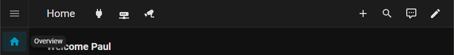

# Home Assistant Home Dashboard Header

Overrides the header of Home Assistant's built-in Home Dashboard (the panel
historically titled "Overview") so it reads **"Home"**, and adds inline shortcut icon
buttons to the header, immediately to the right of the title.



**Not an official Home Assistant feature.** This is a small user script that
relies on internal, undocumented Home Assistant frontend DOM and shadow-root
structure. It is not a supported Home Assistant extension API and may need
updating after a Home Assistant frontend update – see
[Upgrade risk and architectural trade-offs](#upgrade-risk-and-architectural-trade-offs).

Home Assistant is a trademark of the Home Assistant project; this project is
not affiliated with or endorsed by it.

**Status: Working beta – unversioned**

This module is working on the author's Home Assistant installation and has
been tested against the version stated below. It is not yet formally
versioned, and relies on internal Home Assistant frontend implementation
details which may change without notice. Versioning may or may not happen in
the future, depending on whether I decide to version it, or whether I or a
future update from HA breaks it.

## What problem it solves

The built-in Home Dashboard (a.k.a. "Overview", `/home`) has **no stored
configuration** – its header text comes from the frontend's `panel.home` locale
string, which is why it reads "Overview" in English. That means it cannot be
renamed through the normal dashboard editor, Home Assistant Builder (hab), or YAML.

At the same time, the Home Dashboard is an automatically configured dashboard with 
no card slots and very limited customisation options, as far as I can determine a
`button-card` or similar cannot be placed into its header through Lovelace.

This module solves both problems by directly augmenting the native header: it
overrides the title and injects native shortcut controls into the existing
toolbar. No navbar-card, no card-mod, no Global Mod, no HACS dependency.

[Home Assistant Builder (hab)](https://github.com/balloob/home-assistant-build-cli)
is a CLI utility purpose-built for AI agents to manage Home Assistant
configurations, built by Paulus Schoutsen.

## What it does

* Shows **"Home"** instead of "Overview" in the built-in Home Dashboard header.
* Adds a row of **shortcut icon buttons** immediately to the right of the
title (one icon-width gap), rendered as native `ha-icon-button` controls
with `<ha-icon>` elements slotted into them.
* Shortcuts navigate with Home Assistant's own router semantics, so the
browser Back/Forward buttons keep working – no page reload.
* The module is scoped **only** to the built-in Home Dashboard routes:
`/`, `/home`, `/home/overview`. Home Dashboard sub-views and all other
dashboards are left completely untouched, with no absolute/fixed positioning
and no interference with Home Assistant's existing header action items.

## Tested on

* Home Assistant Core 2026.9.3, Frontend 20260826.7
* Because it targets internal frontend structure it is version-sensitive; see
[Upgrade risk](#upgrade-risk-and-architectural-trade-offs).

## Known cosmetic issue

On HA reload or system boot the old view (Overview text, no icons) may remain until 
this user script is injected. Wait until HA has finished loading, then either refresh
the page or switch to another view and return.

Ctrl+F5/Ctrl+Shift+R will not fix this issue while HA is still loading.

This is a cosmetic startup/reload issue and does not affect the module once it
has been injected.

## Installation

1. Copy `home-dashboard-header.js` into your Home Assistant configuration's
`www` folder: `<config>/www/home-dashboard-header.js`.
2. Load it app-wide via `frontend.extra_module_url` in `configuration.yaml`:

```yaml
   frontend:
     extra_module_url:
       - /local/home-dashboard-header.js
   ```

3. **Restart Home Assistant.** A restart is required because you are changing
`frontend.extra_module_url`. After that, editing the JS itself needs only a
**browser hard-refresh** (Ctrl+F5 / Ctrl+Shift+R) – no restart.
4. Navigate to `/home`: the header should read "Home" with your shortcut icons
to its right.

> `extra_module_url` injects the script on every page, but the module only
> *does* anything on the Home Dashboard routes, so other dashboards are
> unaffected.

## Configuring shortcuts

Open `home-dashboard-header.js` and edit the **`SHORTCUTS`** block near the
top – it is the only section you should normally need to change:

```js
const SHORTCUTS = [
  {
    icon: "mdi:power-plug",
    label: "Smart Plugs",
    path: "/smart-plugs",
  },
  {
    icon: "mdi:router-network",
    label: "Network Cupboard",
    path: "/network-cupboard",
  },
  {
    icon: "mdi:cctv",
    label: "Cameras",
    path: "/cameras-dash",
  },
];
```

* `icon` – an MDI icon name (see below).
* `label` – short text; used as the button's tooltip **and** `aria-label`.
* `path` – the URL to navigate to (any dashboard path, e.g. `/energy`).

**The three entries above are example dashboards from the author's setup –
replace them with your own paths.** Add or remove entries freely; the button
row grows to fit. After editing, hard-refresh the browser only – no restart.

## Choosing MDI icons

Icons use [Material Design Icons](https://pictogrammers.com/library/mdi/)
names in the form `mdi:<name>`:

* `mdi:cctv`, `mdi:power-plug`, `mdi:router-network`, `mdi:map`,
`mdi:lightbulb`, ...

The name must exist in MDI or the icon renders blank – verify a name in the
Home Assistant icon picker or on the MDI site. Any MDI icon name supported by
Home Assistant's `ha-icon` component should work here, as the buttons use the
same component for icon rendering.

## How navigation works

The shortcut buttons use the same navigation sequence as Home Assistant's own
router:

1. `history.pushState(..., path)` – adds a browser history entry without
reloading the document.
2. A `location-changed` event is dispatched – Home Assistant's router then
swaps panels exactly as if you had clicked a sidebar item.

Because it is real `pushState` navigation (not `location.href = ...`), the
browser's Back/Forward buttons work and the page is not reloaded. The module
listens for `location-changed` and `popstate`, so the override is re-applied
(or removed) whenever the route changes.

## Route scope – important

The module's `SCOPED` gate allows **only**:

* `/` (bare root)
* `/home`
* `/home/overview`

Everything else – including the Home Dashboard sub-views (`/home/areas-*`,
`/home/media-players`, `/home/other-devices`, which render their own headers)
– is intentionally left alone, and the module cleans up after itself when you
leave these routes.

**Do not add `/lovelace*` routes to the scope.** On HA 2026.9+ `/lovelace/*`
is a **dead route**; dashboards are top-level panels at their own URL (e.g.
`/smart-plugs`). The example shortcut paths above are direct dashboard URLs,
not `/lovelace/...` URLs.

## How it works

The module locates the Home Dashboard header through the current internal
component structure, walking *into* open shadow roots and light DOM rather than
depending on fixed intermediate nesting:

```text
document -> home-assistant -> partial-panel-resolver -> ha-panel-home
        -> hui-root -> hui-root shadowRoot
```

Inside the `hui-root` shadow root it:

* Hides the native `.main-title` text (`font-size: 0`) and renders **"Home"**
via `::before` on `.main-title`. `::before` is deliberate: the shortcut
container is a real child of `.main-title`, and `::after` paints after
children – placing the icons to the left of the word.
* Appends an `inline-flex` shortcuts container into `.main-title`, so the
buttons sit inline in the native toolbar between the title and the existing
action items – no absolute/fixed positioning.
* Arms a **scoped `MutationObserver` on the `hui-root` shadow root**
(`childList` + `subtree`). If Lit or Home Assistant re-renders and wipes the
injected controls, the observer re-injects them – idempotently, so nothing
is ever duplicated. The observer is scoped to that one shadow root, not the
whole document.
* Fails quietly: does not throw or display user-facing errors; diagnostic information
is logged only at console.debug level. If the expected DOM is missing (wrong route,
frontend restructure, slow load), the module retries briefly (about 4 s) and
otherwise logs only `console.debug` messages.

Icons are created as `<ha-icon>` slotted into `ha-icon-button`. In HA
2026.9.x, `ha-icon-button` exposes no `icon` property (it renders an empty
button for it), so the icon is slotted instead – the same technique the
frontend itself uses.

## Upgrade risk and architectural trade-offs

* **`frontend.extra_module_url` is a supported configuration option for
loading frontend modules.** This module uses that loading mechanism without
modifying Home Assistant's installed frontend files.
* **Everything the module touches *inside* that hook is an internal
implementation detail** – the `ha-panel-home` / `hui-root` components, their
shadow roots, the `.toolbar` / `.main-title` / `.action-items` classes, and
Lit's rendering behaviour.
* The MutationObserver protects against **runtime re-renders** (Lit updating
the header, connection restores, and so on). It does **not** make the module
immune to **future frontend restructuring**: if Home Assistant renames
components, changes the shadow-root hierarchy, rewrites the header markup,
or changes how the title is rendered, the module may stop working and need
updating.
* Re-verify after every Home Assistant frontend update.

## After a Home Assistant frontend update

1. Hard-refresh the browser on `/home` (Ctrl+F5 / Ctrl+Shift+R).
2. If the title or shortcuts are gone, open the browser developer console:

   * **No `[home-dashboard-header] module loaded`** – the script
itself is not loading. Check `extra_module_url`. To bust the browser cache
while keeping the same file path, change the URL to
`/local/home-dashboard-header.js?cache=2` – that change does require a
restart.
   * **`toolbar not found`** or **`hui-root not found after 20 tries`** –
Home Assistant changed its internal structure; the `pierce` chain or
class selectors need updating.
   * **`injected ... buttons: 3` but nothing visible** – header styling or
markup changed; the CSS selectors in the injected style need updating.
3. Check the Home Assistant release notes for relevant frontend changes, but
bear in mind that internal DOM changes may not be explicitly documented.

## Troubleshooting

|Symptom|Likely cause|Fix|
|-|-|-|
|Title not changed|Module not loaded, or route not in scope|Hard-refresh; verify URL in `extra_module_url`; confirm you are on `/home`|
|Shortcuts missing, title fine|Container wiped by a re-render the observer missed, or `SHORTCUTS` empty|Hard-refresh; confirm `SHORTCUTS` has entries|
|Blank icon|MDI name does not exist|Fix the `icon` value|
|Brief "Overview" flash on load|Style applied slightly after first paint|Cosmetic; hard-refresh|
|Nothing on other dashboards|By design|Route scope excludes everything but the Home Dashboard|

## Development

This project was developed with AI assistance, including documentation, code review, debugging
and research into Home Assistant's frontend implementation. The resulting code
was developed on and tested against the author's live Home Assistant
installation using the [Home Assistant OpenCode intergration](https://github.com/magnusoverli/opencode), and the MCP access it provides as the development tool.

Getting the DOM traversal and re-render handling working reliably took several
hours and multiple iterations against the author's live Home Assistant
installation.

The code was reviewed and tested by the author, and sanity-checked with a
third-party LLM. OpenCode and its MCP access are **not required** to use this
module.

AI assistance does not imply that the code is officially supported by,
affiliated with, or endorsed by Home Assistant.

## Works on my installation

This user script works on the author's Home Assistant installation and is tested
against the version stated above. There is no guarantee it will work on other
installations or future Home Assistant releases. If it doesn't quite fit your
setup, feel free to modify and adapt it under the terms of the MIT licence.

## Files

* `home-dashboard-header.js` – the module (self-contained, no dependencies)
* `README.md` – this file
* `CHANGELOG.md` – change log
* `screenshot-home-dashboard.png` – screenshot of header
* `LICENSE` – MIT

## License

MIT.

